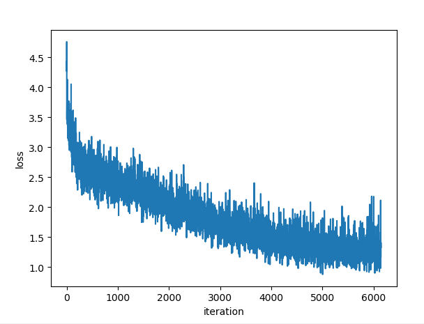

# LSTM_Seq2Seq
Use LSTM+seq2seq to realize the password generation of this paper, [PassGAN: A Deep Learning Approach for Password Guessing](https://arxiv.org/abs/1709.00440)

# Requirements
Pytorch 1.5

# Results

